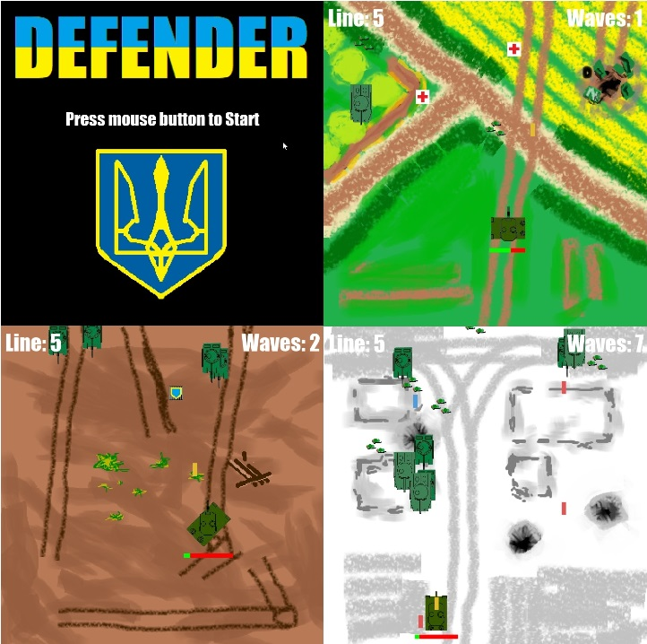
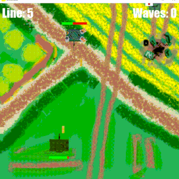

# Game-Defender

 

An arcade style game made in pygame shooting objects coming down the screen.

## Table of Contents
- [Features](#features)
- [Requirements](#requirements)
- [Usage](#usage)
- [File Structure](#file-structure)
- [Author](#author)
- [License](#license)

## Features
- Player controlled Leopard 2 tank with dynamic movement
- 3 stages with a variety of enemies
- 2 Pick-up items (health and armour upgrade)
- Original sound effects

## Requirements
- [Pygame](https://pypi.org/project/pygame/)

## Usage
1. Install the required Python package:

   ```bash
   pip install pygame
   ```

2. Run the script:

   ```bash
   python Defender.py
   ```

3. Follow the onscreen instructions to play. Movement controls are the arrow keys. Firing you weapon is SPACE. Shoot or drive into the oncoming enemies before they pass your position. Try to reach a high level of waves passed.

## File Structure
- `assets`: Folder with png images and mp3s
- `Defender.py`: Python script for running the game

## Author
Alex McKinley

## License
This project is licensed under the [MIT License](LICENSE).
